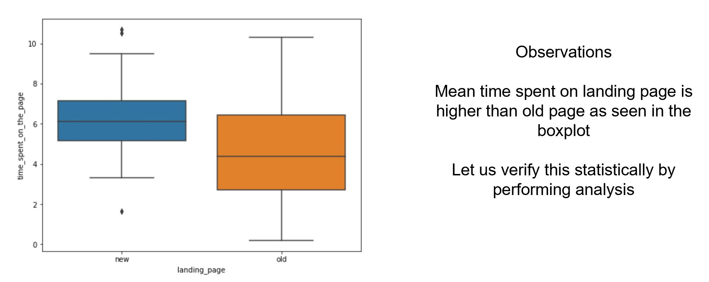
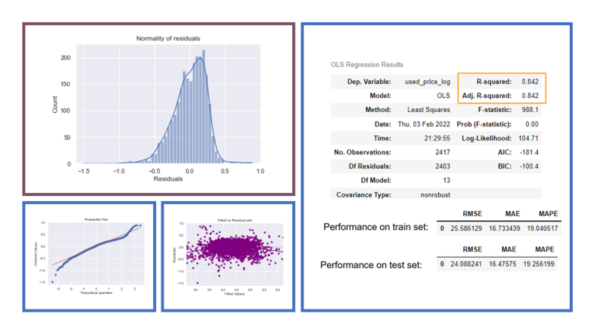

# Carlos_Portfolio

Hi! Here you can find the projects that I've been working through my journey as an Odds/Kid. Yes, as you might have noticed, I am passionate about the Data Science world, but more so about decision making under uncertainty, about odds (probability), and the different methods to quantify uncertainty. 
Contact: cceronlinares@gmail.com

Data Science Portfolio

## [Project 1: Survey Monkey Database](https://github.com/carlosarturoceron/Survey_Monkey)
The client has collected demographic and employment data through a survey, with multiple questions and sub questions, each question can have multiple answers. Client provides raw data and requirements for desired format; client needs to count how many people answered each question and how many gave the same answer. Original dataset is 198x100, final dataset is 17028x10.

[Before](https://docs.google.com/spreadsheets/d/1uh5mW-GYSNhjLtgTrMXQHXYbZ6bmfDkN/edit?usp=sharing&ouid=105935294305889029944&rtpof=true&sd=true) vs [After](https://docs.google.com/spreadsheets/d/146KMv6cd8A4UaPi1YH59wtn5vNKx5a-e/edit?usp=sharing&ouid=105935294305889029944&rtpof=true&sd=true)

### Skills and Tools
Data Manipulation, Joint, Merge, Groupby, Pandas

## [Project 2: FoodHub Data Analysis](https://github.com/carlosarturoceron/Foodhub_Project)
The food aggregator company has stored the data of the different orders made by the registered customers in their online portal. They want to analyse the data to draw some actionable insights for the business. Perform the data analysis to find answers to these questions that will help the company to improve the business.

[Business Presentation](https://drive.google.com/file/d/1YB0L7ZdyFBMT8UNEs5KHNeTE7utUcCKr/view?usp=sharing)

  

### Skills and Tools
Exploratory Data Analysis (Variable Identification, Univariate analysis, Bi-Variate analysis), Python

## [Project 3: Business Statistics: E-news Express](https://github.com/carlosarturoceron/ENews_Express_Project)
This project used statistical analysis, a/b testing, and visualization to decide whether the new landing page of an online news portal (E-news Express) is effective enough to gather new subscribers or not. The simulated dataset has certain important metrics such as converted status and time spent on the page that will help to conclude the effectiveness of the new landing page. Apart from that, the dependence of conversion on the preferred language will also be analysed in this project.

The sample standard deviation of the time spent on the new page is: 1.82 min.

The sample standard deviation of the time spent on the old page is: 2.58 min.

In order to compare the means from 2 independent populations when standard deviations are unknown, we will use a 2-sample-independent t-test. A
As the p-value 0.000139 is less than the level of significance, we reject the null hypothesis. We have enough statistical data to support that the time spent by users in the new page is not equal to the old page. In fact, it is higher in the new page!

[Business Presentation](https://drive.google.com/file/d/18AZm43BkgNsA55AIeeeBoPg-3kfZ7aXT/view?usp=sharing)

### Skills and Tools
Hypothesis Testing, a/b testing, Data Visualization, Statistical Inference, ANOVA

## [Project 4: Life Expectancy Model]()
To analyse the data and build a linear regression model that can predict the life expectancy of the people of a country.

Key Questions:
* Does life expectancy have a positive or negative correlation with the different factors (immunization, mortality, socio-economic, etc.) taken into consideration for the countries?
* Can we build a linear model to predict life expectancy? If yes, how accurate will the model be?

Visualization:

Observations:
* The training R2 is 0.85, so the model is not underfitting.
* The train and test RMSE and MAE are comparable, so the model is not overfitting either.
* MAE suggests that the model can predict life expectancy within a mean error of 2.8 years on the test data.
* MAPE of 4.3 on the test data means that we can to predict within 4.3% of the life expectancy.

### Skills and Tools
Linear Regression, Model Tuning, Model Performance

## [Project 5: ReCell](https://github.com/carlosarturoceron/ReCell)
Buying and selling used phones and tablets used to be something that happened on a handful of online marketplace sites. But the used and refurbished device market has grown considerably over the past decade, and a new IDC (International Data Corporation) forecast predicts that the used phone market would be worth $52.7bn by 2023 with a compound annual growth rate (CAGR) of 13.6% from 2018 to 2023. This growth can be attributed to an uptick in demand for used phones and tablets that offer considerable savings compared with new models.

The rising potential of this comparatively under-the-radar market fuels the need for an ML-based solution to develop a dynamic pricing strategy for used and refurbished devices. ReCell, a startup aiming to tap the potential in this market, wants you to analyze the data provided and build a linear regression model to predict the price of a used phone/tablet and identify factors that significantly influence it.

Key Questions:
* Does life expectancy have a positive or negative correlation with the different factors (immunization, mortality, socio-economic, etc.) taken into consideration for the countries?
* Can we build a linear model to predict life expectancy? If yes, how accurate will the model be?

Visualization:

[Business Presentation](https://drive.google.com/drive/u/0/folders/10by5yXJLjvqHsNKdjbYyLPwGDvjcJ6kg)

Observations:
* Model can explain 84% of the variance in the resale price of a device.
* We can predict the resale price of a device within $19.25 if we know its features.
* We should avoid devices with an OS that is not Android or IOs.
* 93% of devices studied in this dataset run Android as operating system

### Skills and Tools
Linear Regression, Model Tuning, Model Performance

